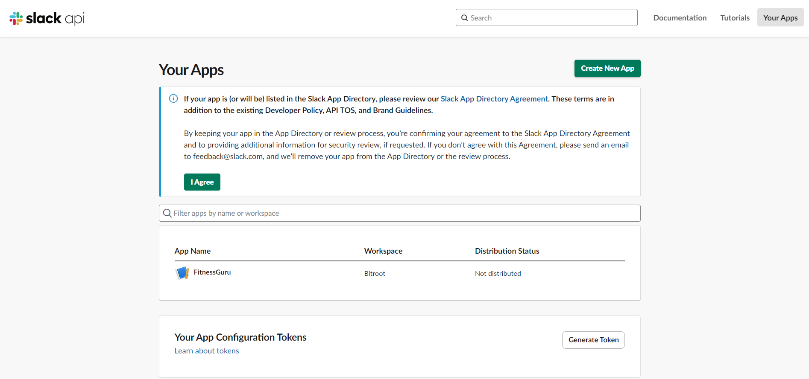
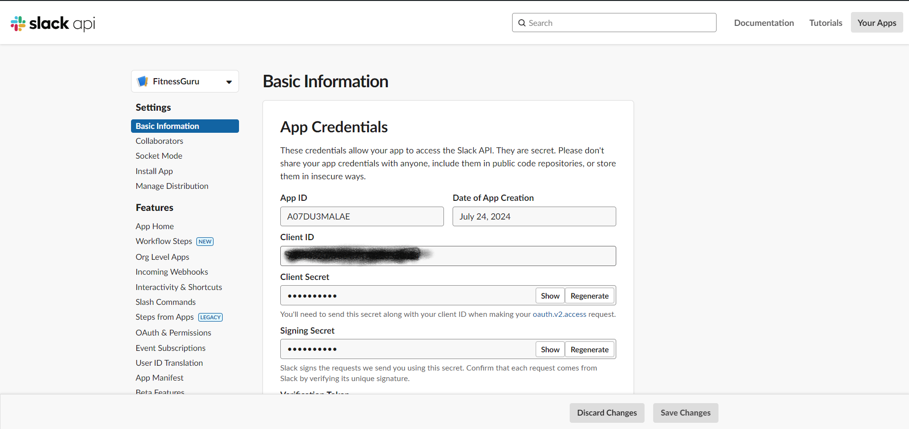
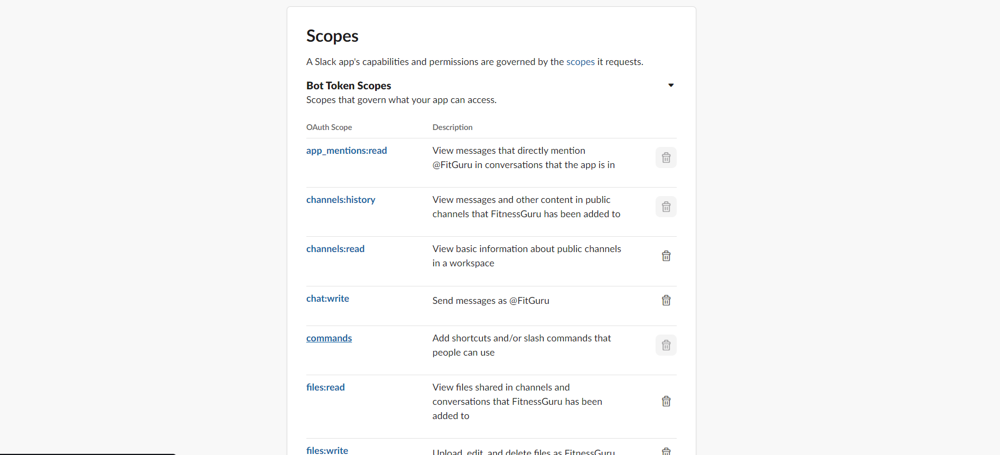
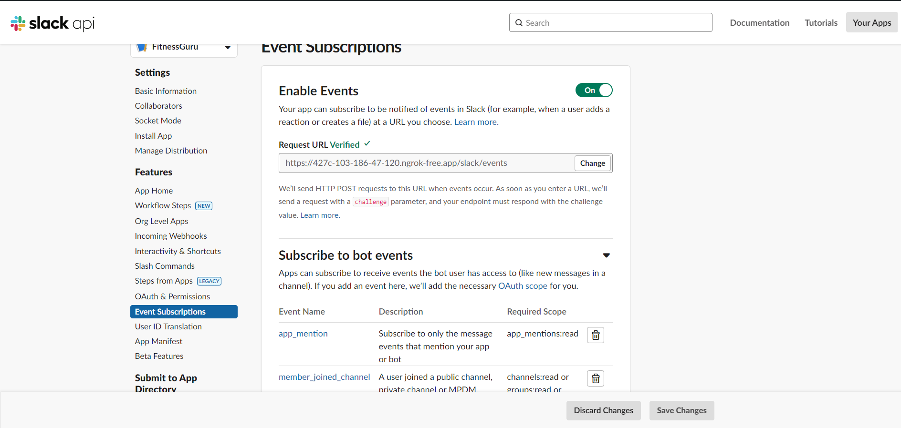
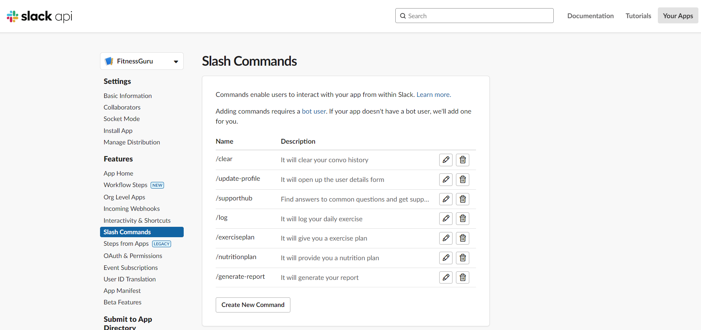

# FitnessGuru Slack Bot

FitnessGuru is a comprehensive Slack bot designed to assist users with their fitness goals. Built using Node.js and leveraging the Slack API, this bot offers various features to support users' health and wellness journey.

## Table of Contents

- [Overview](#overview)
- [Prerequisites](#prerequisites)
- [Features](#features)
- [Setup](#setup)
- [Installation](#installation)
- [Usage](#usage)
- [Configuration](#configuration)
- [Contributing](#contributing)
- [License](#license)

## Overview

FitnessGuru is designed to provide personalized assistance to users by offering tailored exercise and nutrition plans. It integrates seamlessly with Slack and responds to various commands to enhance user interaction.

## Prerequisites

Before starting the project, developers need to set up a few steps in Slack:

1. **Create a Slack App**: Visit the [Slack API](https://api.slack.com/apps/A07DU3MALAE/general) and create a new app.

   

2. **Gather Required Credentials**: Navigate to the `Basic Information` section and retrieve all necessary credentials such as `App ID`, `Client ID`, `Client Secret`, `Signing Secret`, and `Verification Token`.

   

3. **OAuth & Permissions**: Go to `OAuth & Permissions` and assign the required permissions to the bot to interact with channels and users.

   

4. **Event Subscriptions**: Enable event subscriptions and provide the request URL where your app will listen. Subscribe to `bot events` and `events on behalf of users`.

   

5. **Slash Commands**: Set up the necessary slash commands that the bot will respond to. Navigate to the `Slash Commands` section and add each command.

   

6. **Interactivity & Shortcuts**: Configure interactive components by specifying a URL for handling interactions with shortcuts, modals, or components like buttons and select menus.

   

7. **Set Up ngrok**: Install ngrok by following the [ngrok getting started guide](https://ngrok.com/docs/getting-started/). Use the generated link to integrate with the Slack app settings wherever needed.

8. **Install Redis**: Ensure Redis is installed and running before starting the project.

## Features

### Personalized Assistance

- Provides guidance on tracking fitness-related data
- Helps plan customized exercises based on individual profiles
- Offers personalized nutrition plans tailored to each user's needs

### Command Handling

- Responds to various commands for easy interaction:
  - `/update-profile`: Opens the user details form
  - `/log`: Logs daily exercise
  - `/clear`: Clears conversation history
  - `/supporthub`: Finds answers to common questions
  - `/exerciseplan`: Generates personalized exercise plans
  - `/nutritionplan`: Creates personalized nutrition plans

### User Engagement

- Sends welcome messages to both main channels and direct messages
- Presents detailed information about available commands and features

### Integration

- Utilizes the Slack API for seamless integration with Slack workspaces
- Employs environment variables for secure storage of sensitive information

## Setup

Follow these steps to set up the Slack bot:

1. Clone the repository:
    ```bash
    git clone https://github.com/CHANDAN2901/slack-bot.git
    cd slack-bot
    ```

2. Install dependencies:
    ```bash
    npm install
    ```

3. Create a `.env` file in the root directory and add your Slack bot token and other environment variables:
    ```env
    SLACK_BOT_TOKEN=your_bot_token_here
    ```

4. Start the bot:
    ```bash
    npm start
    ```

## Usage

Once the bot is running, you can interact with it in your Slack workspace. Type any message in a Slack channel or use slash commands to see the bot respond.

To add custom commands:

1. Edit the `src/slackCommands.js` file.
2. Restart the bot.

## Configuration

Sensitive information like the Slack bot token should be stored in environment variables. The bot looks for these values in the `.env` file.

## Contributing

Contributions are welcome! Please feel free to submit pull requests or issues.

## License

This project is licensed under the MIT License - see the [LICENSE.md](LICENSE.md) file for details.

## Additional Resources

- [Slack API Documentation](https://api.slack.com/)
- [Node.js Documentation](https://nodejs.org/api/)

---

**Note**: Ensure all image files referenced in this README are present in the `images` folder of your repository for proper rendering on GitHub.